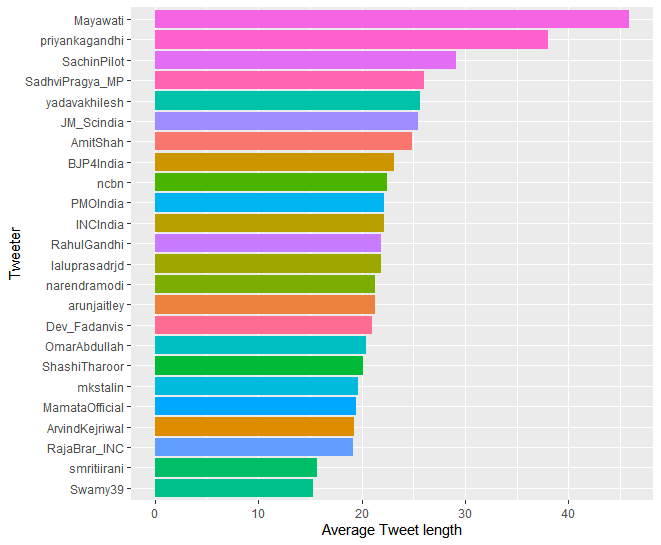
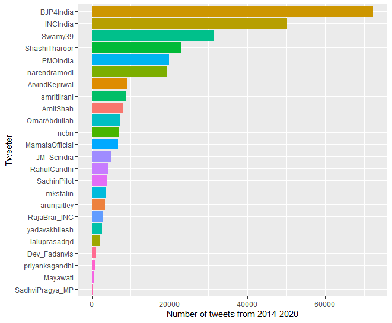

# indian-political-twitter-analysis

## Parameters of Statistics and Sentiment Analysis done on tweets by Indian politicians between 2014 and 2020

### Time Frame
2014 - 2020 May

### Tools
R
[syuzhet package](https://www.red-gate.com/simple-talk/sql/bi/text-mining-and-sentiment-analysis-with-r/)

### Data Acquisition
I am using [GetOldTweets3](https://github.com/marquisvictor/Optimized-Modified-GetOldTweets3-OMGOT) to acquire data.

Downloading this amount of data is fraught with problems. I managed to make my way around some of them by using the TIMOUT /T command in batch files.

### Target Accounts
All major politicians who tweet in English.
Feel free to comment and suggest more.

The current list is provided in a txt file in this project.

## Analyses performed

### Average Length per tweet

### Average Length per tweet

